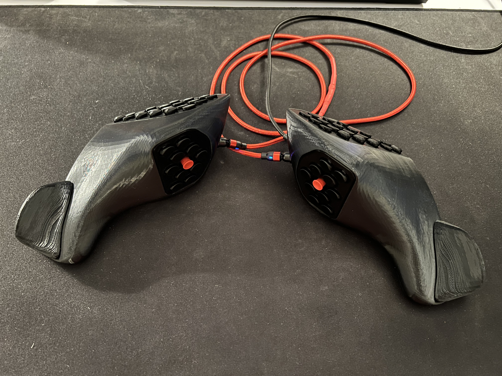
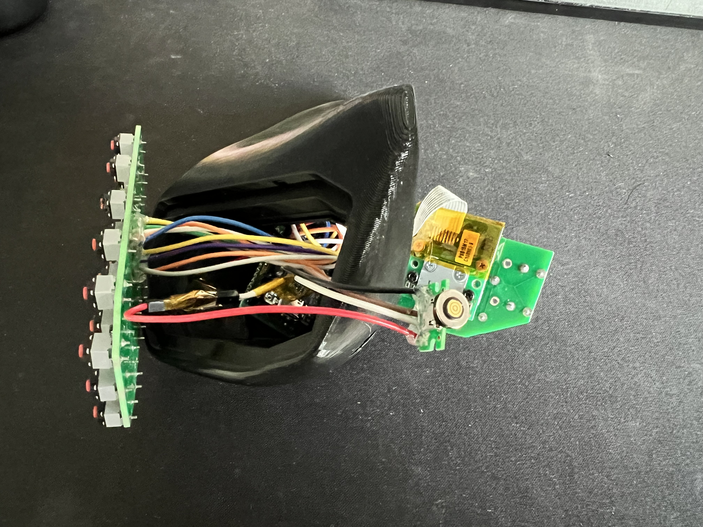
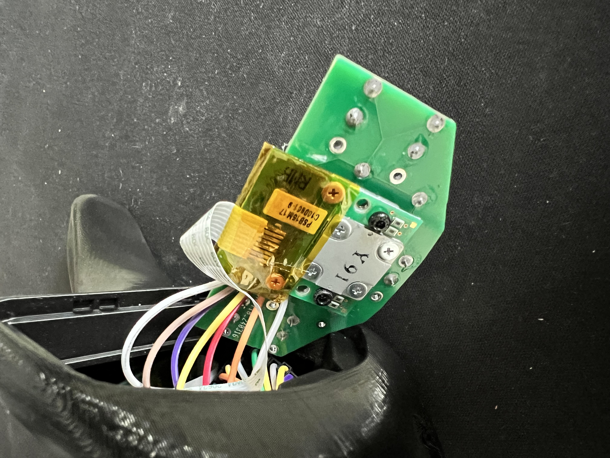
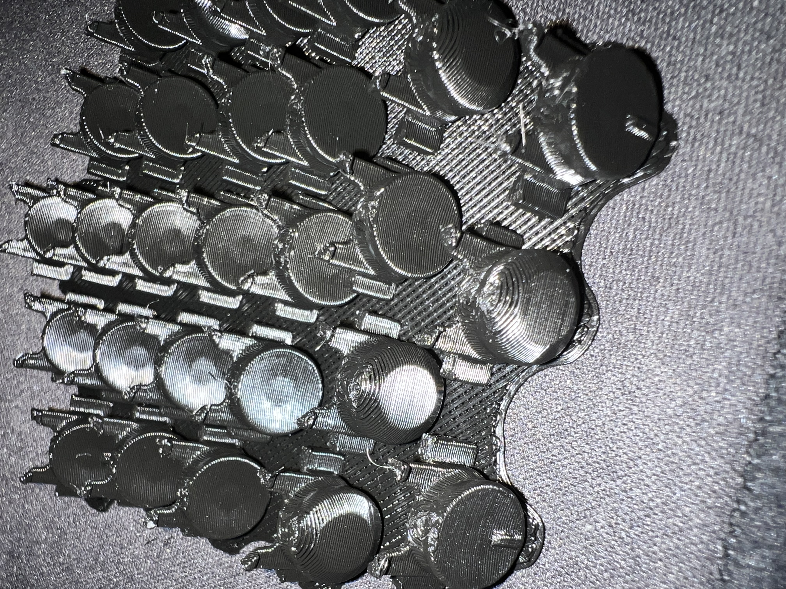

# Lynxware Cat with trackpoint

https://www.lynxware.org/

I made some modifications to the case to work with the hardware I have. I already had some dual trackpoint code working in QMK so I made the connection wired and setup the matrix for qmk. I really like the magnetic usb cables so I carved out enough room for them. 

There's plenty of room on the inside so I was able to fit the reset circut easily.

I was able to get a much better surface finish on the keys by printing them at an angle. And I added wings to them to keep them from falling outwards because I was using smaller silent mouse switches.

https://www.lynxware.org/